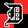

# Dungeons Character Dashboard: Chrome Extension

 

A Manifest V3 Chrome Extension which loads current status information from [@dungeons@mastodon.social](https://mastodon.social/@dungeons)

[Dungeons](https://dungeons.astrelion.com/) is an open-source D&D 5e-style RPG, played via community poll, on Mastodon. It was created and is maintained by [Astrelion](https://mastodon.social/@astrelion). This project is NOT affiliated with Astrelion or [@dungeons](https://mastodon.social/@dungeons).

Follow [@Dungeon_Guide](https://mastodon.social/@dungeon_guide) a GPT-based Mastodon bot I created to help (it's GPT-3 so curb your expectations) the Dungeons community!


### Required Permissions:

None

## Installation

0.  Clone this repo to your local machine

```bash
git clone https://github.com/skullzarmy/dungeons-chrome-extension.git
```

or [download .zip](https://github.com/skullzarmy/dungeons-chrome-extension/archive/refs/heads/main.zip)

1.  Open Chrome and navigate to `chrome://extensions` by typing it into the address bar and hitting enter.

1.  At the top right [↗] of the page, toggle on "Developer mode". This will enable additional options for loading in custom extensions.

    

1.  At the top left [↖] of the page, click on the "Load unpacked" button that appears once you have enabled developer mode.

    

1.  A file selection dialog will appear. Navigate to the directory where you cloned the repo, and select the directory.

The extension should now appear in your list of extensions and be available for use. You should see its icon [  ] in the extensions section of the Chrome toolbar. If the icon doesn't appear, you may need to click on the Extensions icon (which looks like a puzzle piece) in the Chrome toolbar and pin your extension so that its icon is always visible.

If you download a new version, first replace the files in the extension directory with the new versions, then you can click the "Reload" button on your extension's box in the chrome://extensions page to load in the changes.

Remember, your extension will only be available in the current profile and on the current device where you loaded it. If you sign in to a different Chrome profile, or use a different device, you'll need to load the extension again.

## LICENSE

MIT License

Copyright (c) 2023 skllzrmy [Joe Peterson](https://joepeterson.work)

[LICENSE FILE](LICENSE)

### LOGO COPYRIGHT

 (D Brand Logo) is wholly owned and copyrighted as follows:

Copyright (C) 2023 ASTRELION [License](https://gitlab.com/ASTRELION/dungeons-bot/-/raw/main/LICENSE)

Original source: https://gitlab.com/ASTRELION/dungeons-bot

Original account: https://mastodon.social/@dungeons

**This mark is used without express permission or license.**

**Use of this mark is not intended to convey affiliation with Astrelion**
